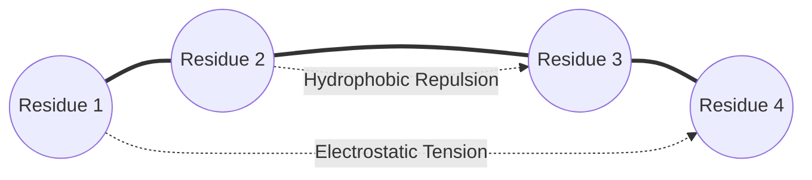

# Protein Folding Simulation via Agentix Geometric Engine

This simulation demonstrates how the Agentix relational engine handles the highly complex problem of **Protein Folding** using non-Euclidean manifold curvature instead of traditional probabilistic models, search algorithms, or Reinforcement Learning (RL).

---

## 1. The Challenge: Levinthal's Paradox

Levinthal's Paradox states that for a relatively small protein chain (e.g., 100 amino acids), the number of possible physical conformations is astronomically large. 
- If each residue can exist in just 3 different structural states, a 100-residue protein has $3^{100} \approx 5 \times 10^{47}$ unique conformations.
- If a protein folded by randomly sampling all possible configurations at a rate of one configuration per picosecond ($10^{-12}$ seconds), it would take approximately **$1.6 \times 10^{27}$ years** to find its correct native state (which is longer than the age of the universe).
- Yet, in nature, proteins fold spontaneously and reliably into their functional 3D shapes within **microseconds to milliseconds**.

This discrepancy proves that folding is not a random trial-and-error process. Instead, it is guided by local and global electrostatic, hydrophobic, and steric forces that direct the chain down a funnel-like energy landscape.

---

## 2. The Agentix Paradigm: Manifold Curvature vs. Probability/RL

Traditional computational biology approaches (such as AlphaFold or deep Reinforcement Learning) utilize massive neural networks to predict coordinate distances or formulate policy gradients. 

Agentix resolves folding by redefining the protein chain as an **agentic graph embedded in a curved Riemannian manifold**:

### The Mechanism

1. **Amino Acids as Autonomous Nodes**: Each amino acid (residue) acts as a local agent with its own servo-like angular constraints and electrostatic charges (valences).
2. **Dynamic Metric Tensor ($g_{ij}$)**: Instead of assuming flat Euclidean space, the distance metric between residues is dynamically warped by their charges, hydrophobicity, and local structural constraints.
3. **End-Point and Local Homeostasis**: By locking the endpoint forces (or treating target structural domains as anchor sites), the intervening residues adjust their torsion angles to minimize the local geometric tension.
4. **Energy Minimization**: The folding process is solved as a continuous, deterministic flow down the geodesic path of the curved manifold:

$$\mathbf{v}_i = -\nabla_{g} \Phi(x)$$

Instead of simulating probabilistic molecular dynamics collisions or training RL agents to guess actions, the residues simply slide along the gradient of the curved manifold toward topological equilibrium (homeostasis).

---

## 3. Computational Complexity Comparison

| Dimension | Probabilistic / MC Methods | Reinforcement Learning (RL) | Agentix Relational Engine |
| :--- | :--- | :--- | :--- |
| **Search Paradigm** | Random walk / Stochastic Sampling | Policy Optimization & State Space Exploration | Deterministic Flow on Curved Manifolds |
| **Time Complexity** | $\mathcal{O}(d^N)$ (exponential where $N$ is chain length) | $\mathcal{O}(K \cdot N^2)$ training; $\mathcal{O}(N)$ inference | $\mathcal{O}(N^2)$ direct tension calculation per epoch |
| **Hardware Overhead**| Supercomputing clusters / GPUs | High GPU training requirements | Lightweight, running on CPU/Edge (Zero-Branching) |
| **Convergence** | Probabilistic (may get stuck in local minima) | Approximated via reward shaping | Deterministic Geodesic Convergence via Perturbations |

### Why Agentix is Faster

- **Zero-Branching execution**: Agentix calculates the tension forces branchlessly using vector arithmetic. There are no expensive logical checks or stochastic random selections.
- **Immediate Local Resolvers**: Every joint resolves its coordinates autonomously without waiting for global matrix transformations, bypassing the heavy coordinate-updates of typical molecular dynamics.
- **Deadlock Resolution**: When the protein chain gets trapped in a local minimum energy state (a structural deadlock), Agentix applies a **non-Euclidean geodesic perturbation** (twisting the metric tensor of the state space), enabling the chain to "tunnel" past the structural barrier instantly and continue folding toward the native state.
